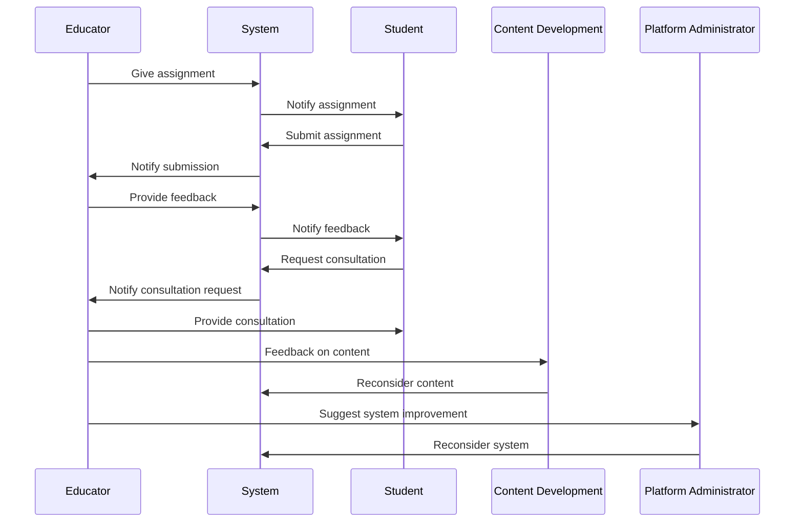

```mermaid
sequenceDiagram
    participant Educator
    participant System
    participant Student
    participant ContentDevelopment as Content Development
    participant PlatformAdmin as Platform Administrator

    Educator->>System: Give assignment
    System->>Student: Notify assignment
    Student->>System: Submit assignment
    System->>Educator: Notify submission
    Educator->>System: Provide feedback
    System->>Student: Notify feedback
    Student->>System: Request consultation
    System->>Educator: Notify consultation request
    Educator->>Student: Provide consultation
    Educator->>ContentDevelopment: Feedback on content
    ContentDevelopment->>System: Reconsider content
    Educator->>PlatformAdmin: Suggest system improvement
    PlatformAdmin->>System: Reconsider system
```
